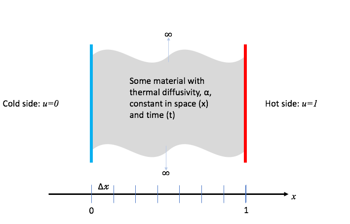

# Hand Coded Solution of the 1D Heat Equation

**Questions** | **Objectives** | **Key Points**
-------------------------


What is the FTCS algorithm for numerical solution of the heat equation?
How does thermal diffusivity effect time to solution?
What is stability of the numerical algorithm?
What is the difference between an explicit and implicit method?
How does choice impact time to solution, memory, accuracy, stability?
Objectives (e.g. What new skills, knowledge experience will learners gain in this lesson)

Understand how choices in numerical solution method impact such things as…
time to solution (e.g. time-performance)
memory usage (e.g. space-performance)
accuracy and stability of solution
Understand how non-trivial problems become intractible with hand-coded solutions
Understand how to interpret performance data gathered from PAPI
Key Points (e.g. What should learners take-away from this lesson)

There are often trade-offs in algorithm behavior
Complex problems/situations are not easy to hand-code


In this lesson, we use a simple, hand-coded, C application to solve
a few different variations of the one dimensional heat equation as
shown here...



## Step 1: Compiling The Application

If the application is already compiled for you, proceed to step 2

Note, to get useful timing and flop count information, you must
compile the application with PAPI. You may compile without PAPI
but you will not be able to observe how changes in parameters
effect memory usage, timing and flop counts.

```
cc -DHAVE_PAPI heat.c -o heat -I<path/to/papi/include> -L<path/to/papi/lib> -lpapi
```

## Step 2: Getting help

At any point, you can get help regarding various options the
application supports like so...

```
./heat --help
Usage:
    ./heat <arg>=<value> <arg>=<value>...
        alpha=0.2      thermal diffusivity of material (0.2)
        dx=0.1         x-incriment (1/dx->int)
        dt=0.004       t-incriment
        alg="ftcs"     algorithm ("ftcs", "upwind15", "cn")
        eps=1e-6       convergence criterion
        bc0=0          boundary condition @ x=0: u(0,t)
        bc1=1          boundary condition @ x=1: u(1,t)
        ic="const(1)"  initial condition @ t=0: u(x,0)
        savi=0         save every i-th solution step
        save=0         compute/save error in every saved solution
        prec="double"  precision half|float|double (double)
Examples...
    ./heat Nx=51 dt=0.002 alg=ftcs
    ./heat Nx=51 bc0=5 bc1=10
```

## Step 3: Visualizing Results

The results produced by this application are simple space separated values
text files containing xy pairs of numbers. These can be visualized with
many different tools. Here, we demonstrate the use of VisIt primarily because
VisIt will be useful in visualizing more sophisticated results produced
by more complex examples in later lessons.

